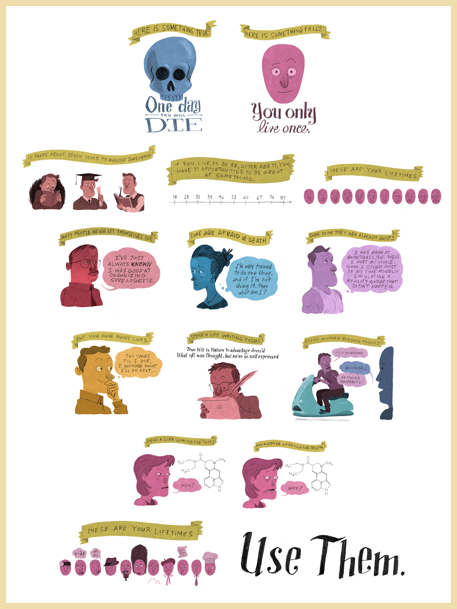

Here's a bunch of ideas I think are important, maybe even life-guiding. some of them are anxieties, some of them are ~~stolen~~ borrowed from other people, I hope to update it when something hits me just right

I'm afraid of economic instability

but more than that I'm afraid of wasting my time on things that don't matter

I'm allowed to be inconsistent

the worst thing you're realistically going to do to me is look at me funny

Radical empathy is not only possible, but necessary -amanda palmer

"Lying to yourself about what you want to achieve is a very common hurdle, for people of all ranges of experience in fitness. Some people bury what they really want because they're afraid of being vain, or selfish, or otherwise being judged. This behavior will hinder you in achieving your goals no matter what they are. Somebody can always be found to judge you for what you want, because the world is full of bucket crabs and people suffering from tall poppy syndrome. Ignore them. If you don't get clear on what your real goals are, you can't pursue them effectively, and you may end up giving up because you are chasing a goal you don't actually want. It's also important to keep in mind that the best person to determine your goals is you, as only you can know or decide what you really want. Be receptive to the advice of experienced people, but don't let others dictate what your end game is or should be.

This also involves being honest with yourself about the amount of effort, commitment and consistency you are putting into your fitness. If you are "half-assing" it by lolly-gagging in your workouts, only tracking your food sometimes, or not going to the gym consistently, you must be able to identify and accept these shortcomings in your effort level and how they will limit your ability to get results. Physical fitness is very much an arena where you will get out what you put in."

- https://www.reddit.com/r/Fitness/wiki/general_advice#wiki_be_honest_with_yourself

replace fitness with life

stop lying to yourself about what you want to do
stop worrying about being judged for wanting it
figure out what you want to do, not just this summer, but after school

say it all works out, you get out of school, you get into AAA to get your feet wet, you leave and make your own studio you're in charge of

what then?
this is something you should start moving towards now if you want it to happen

these are the ideas you should keep looping on until you develop to that point

I really want to be that guy that makes sword art online. I want to build that hyper immersive universe that thousands live in and for, where they meet their significant others and can feel at home when real home is not great

i want to sell nutty ar tech to everyone and for it to become the platform of today, i want real life to have a UI in every aspect, enhancing normal human existence beyond what's possible without it. i want to make and sell ar assisted training programs that teach people to be better people in whatever ways they desire, i want tutorials for everything in life

i want to wave my hand to command a fleet of bots to do, whatever my bidding happens to be, and for computers to read people so well it's as if they're one

https://www.smbc-comics.com/comic/2012-09-02

"If you want to build a fleet, don't drum up people to collect wood and assign them tasks and work, but rather teach them to long for the boundless immensity of the open sea." -Antoine St. Exupury

https://www.youtube.com/watch?v=kANGHaH4aKU

you don't have to be a painter or visual artist to still be an artist

you don't have to be good at drawing or music or anything to be an artist

coding still counts in a way

yeah you can't hang it on a wall

but you still make art

it can be elegant

it can be beautiful

they're made out of meat is a phrase i really love as a way to express human fragility

i'm made of meat! you're made of meat! we're all just meat flapping our meat at each other!

http://www.terrybisson.com/page6/page6.html
