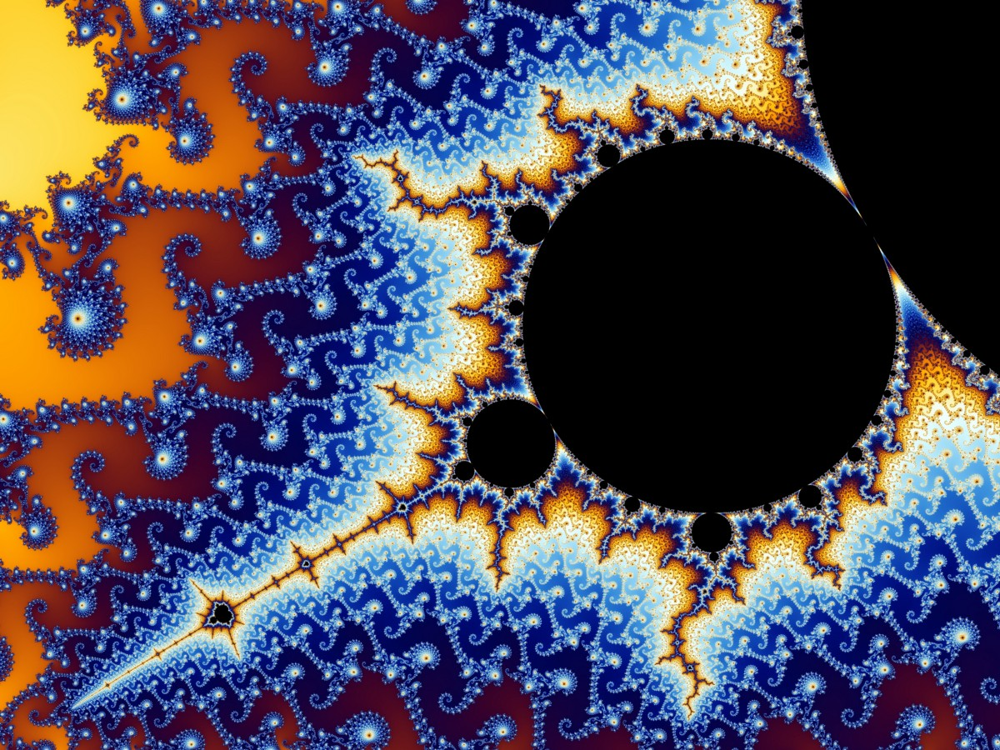

# Chaos Games and Procedural Generation

I feel like chaos/chaos theory has a very interesting way of generating images and/or graphics, particularly fractals. You can get extremely detailed and infinite graphics with different initial conditions.

One of the ones Dr. Passmore covered in his colloquium last Monday was the Sierpinski triangle, generated with a 3 point ‘chaos game’. You begin with 3 initial points, about where the tips of the triangle would be, and then start at any point within those boundaries. Then you roll a die or use some other random method of choosing one of the initial coordinates, and travel half the distance between your starting point and the initial point chosen. At the end of the day, i.e., after doing this for several hours, you can somewhat reliably generate the Sierpinski triangle.

> Animated creation of a Sierpinski triangle using the chaos game \([Wikipedia](https://en.wikipedia.org/wiki/Sierpinski_triangle#/media/File:Sierpinski_chaos_animated.gif)\)

And that’s really just the tip of the iceberg. Other methods using chaos can make similarly complex patterns with different and never ending detail.

Recently, it’s been popular to use similar methods for generating things within game universes as well. Procedural generation, the process of using algorithms and processes to build a world, character, or questline rather than individually designing them, has become a somewhat common practice among not only indie developers, but large AAA studios as well.

> Section of a Mandelbrot set, a type of fractal \([Wikipedia](https://en.wikipedia.org/wiki/Benoit_Mandelbrot#/media/File:Mandel_zoom_08_satellite_antenna.jpg)\)

The one problem I’ve noticed with using chaos as a generative element in games through landscapes or scenarios is that it can lead to the end result having an overall “soulless” feeling. Games which incorporate random generation of landscapes such as Minecraft, Terraria, and Starbound can often ‘feel’ different yet exactly the same as you continue exploring the world. Every area has an echo of other areas since they all use the same process, but since none of them are created by a person who has an overall plan in mind, they never really form a cohesive whole compared to a game which has a fully designed world.

Similarly, games with random scenarios or quests like Fallout 4 and XCOM 2 can suffer from the same thing over time. Once you mentally register the fact that what you’re doing doesn’t affect an overall plotline and is just a generated to-do list, it can shatter both immersion and motivation to continue playing.

Which brings us to No Man’s Sky, “[a science-fiction game set in an infinite procedurally generated galaxy](https://www.nomanssky.com/)” set to release in summer of this year.

!\[A screenshot from No Man’s Sky\]\[no-mans-sky\]

> A screenshot from [No Man’s Sky](https://www.nomanssky.com/)

It’s completely embracing procedural generation, and boasts the fact that it isn’t ‘designed’ in the traditional sense. From what I’ve seen, the game is straight up gorgeous in its design and overall aesthetic, but I’ve also found myself in the camp of people who feels that it will get boring quickly.

I really hope I’m wrong.

\[no-mans-sky\]: ../assets/img/no-mans-sky.png

