# A Flick of the Wrist: Defining the Next Generation of Human-Computer Interaction

The following is a written version of a talk I did at TedX Goldey Beacom in January 2019. They filmed it, which you can watch [here](https://www.youtube.com/watch?v=lq8cvQSfiMs)!

---

For years, we've been enchanted by the idea of magic. The thought that someone, with the wave of a wand, snap of a finger, or some special words, can completely change the world around them in an instant is an idea that has captured minds throughout history.

 

Right now, we live in a world where we manipulate the entirety of human knowledge on screens barely bigger than credit cards. I’d be willing to bet that everyone in this room has a device in their pocket that has more computing power than the technology we used to send people to space. And relative to the rest of human history, it’s all happened in the blink of an eye. It’s really difficult to overstate how far we’ve already come, even within my lifetime.

  

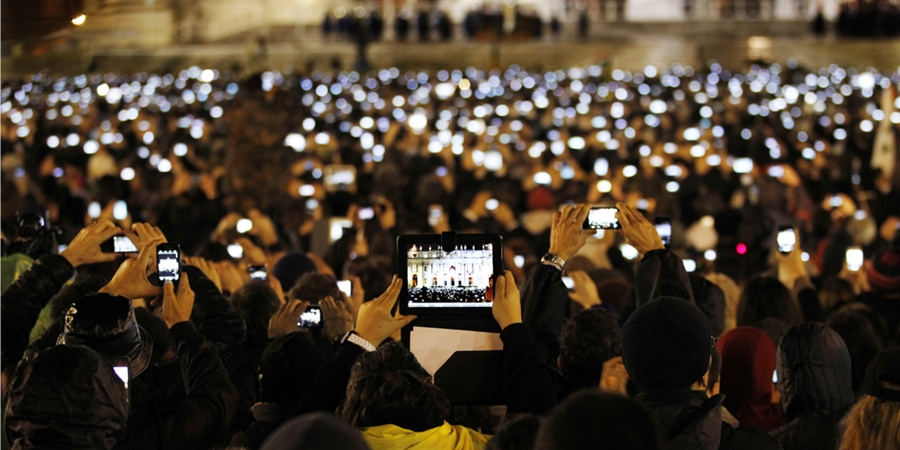

[_St. Peter’s Square in 2005 vs 2013 via NBC_](https://github.com/AlinaWithAFace/alinawithaface.github.io/tree/1a9d04fc69b3ad64623cd7951e076f77f9a0135b/_posts/%28http:/photoblog.nbcnews.com/_news/2013/03/14/17312316-witnessing-papal-history-changes-with-digital-age%29/README.md)

With the advent of extended reality, machine learning, and other emerging technologies, the way we work with computers and each other is going to drastically evolve over the next several years. We are increasingly able to not only perceive digital worlds in three dimensions but interact with and be seen by them in return. This is in essence, what the field of human-computer interaction is developing.

Today, I’m going to show you some HCI research projects that are pushing the boundaries of technology. I invite you to look ahead at how they will fundamentally change how we interact with computers, information, and each other.

But first, take a moment to dream with me. It’s 20XX, a Tuesday.

Imagine being a kid taking chemistry for the first time. Remember learning molecular geometry? The thing where atoms are arranged in various 3D shapes like tetrahedra and trigonal pyramidals? You had to draw them out on paper, using nothing but a pencil and ruler to visualize these abstract shapes that make up fundamental pieces of our world.

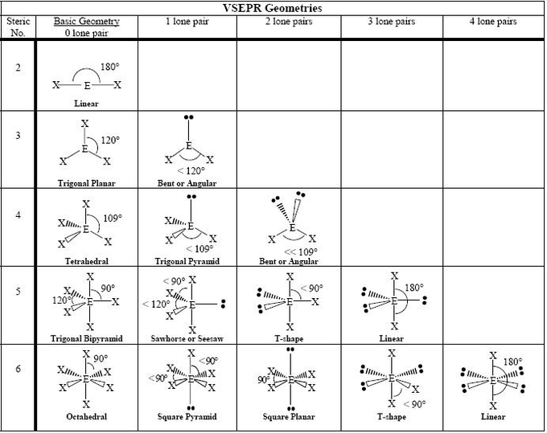

Or, maybe you were a bit luckier and did an activity where you arranged playdough and toothpicks like I did in high school. They are really sad and droopy.

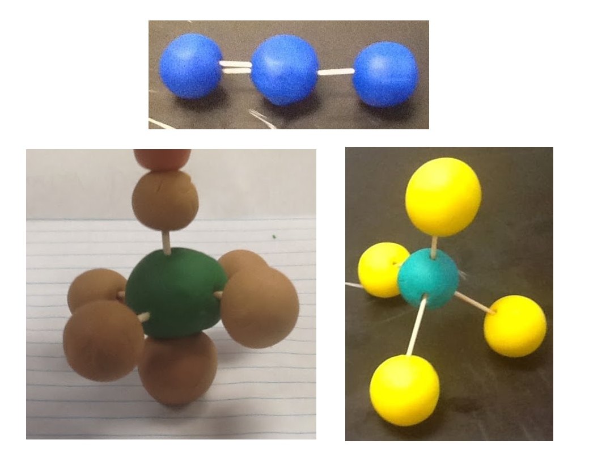

Instead of that, kids in 20XX play with holograms, building out octahedra and seesaws with their bare hands in space. They can manipulate atomic bonds intuitively, playing with digital representations that function as we understand things to at an atomic level.

Imagine you're out hiking and see a gorgeous landscape of mountains. Inspired by their beauty, you whip out your sketchbook, but you don't exactly have an entire collection of paints on your person. But that doesn't matter, as you draw thin wobbly lines, it transforms into a picturesque landscape painting right before your eyes.

You get home from work and jump into a game that basically puts you into the matrix. As the lone hero, you stand alone in a hostile world. You’re swarmed by agents, and dodge bullets in slow-motion using your entire body.

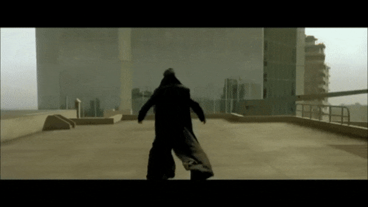

Now, you want to tell me that all of these sound crazy, requiring tech we don’t have, right? But it turns out, "20XX" is actually 2018. These are some of the things we did _last year_.

The chemistry application is [Project Pupil](https://github.com/AlinaWithAFace/alinawithaface.github.io/tree/1a9d04fc69b3ad64623cd7951e076f77f9a0135b/_posts/%28https:/www.etc.cmu.edu/blog/projects/pupil/%29/README.md) at Carnegie Mellon.

 

_via_ [_Yujin Ariza_](https://github.com/AlinaWithAFace/alinawithaface.github.io/tree/1a9d04fc69b3ad64623cd7951e076f77f9a0135b/_posts/twitter.com/YujinAriza/status/1068619034827083783/README.md)

The painting? An application by [Memo Akten](https://github.com/AlinaWithAFace/alinawithaface.github.io/tree/1a9d04fc69b3ad64623cd7951e076f77f9a0135b/_posts/%28https:/www.memo.tv/portfolio/learning-to-see/%29/README.md).

 

[_Painting a mountain_](https://vimeo.com/302624466)

The slow-motion shooter? [Super Hot](https://github.com/AlinaWithAFace/alinawithaface.github.io/tree/1a9d04fc69b3ad64623cd7951e076f77f9a0135b/_posts/%28https:/superhotgame.com/vr/%29/README.md), which you can literally go to a VR arcade to play _right now_.

 

[_Superhot VR Trailer_](https://github.com/AlinaWithAFace/alinawithaface.github.io/tree/1a9d04fc69b3ad64623cd7951e076f77f9a0135b/_posts/%28www.youtube.com/watch?v=pzG7Wc6mbwE%29/README.md)

So, what are these things anyway? How are we doing this?

For the uninitiated, XR is used as an umbrella term to describe a continuum of combinations of real and virtual objects interacting in tandem. This includes technologies like virtual reality, where your entire environment is digital, augmented reality, where you overlay flat images onto the real world, and any dimension in between.

 

[_Leap Motion Mirrorworlds Concept Video_](https://github.com/AlinaWithAFace/alinawithaface.github.io/tree/1a9d04fc69b3ad64623cd7951e076f77f9a0135b/_posts/%28https:/www.youtube.com/watch?v=kTv7aQx09XI%29/README.md)

Maybe you’ve played with primitive augmented reality systems, like [Pokemon Go](https://github.com/AlinaWithAFace/alinawithaface.github.io/tree/1a9d04fc69b3ad64623cd7951e076f77f9a0135b/_posts/%28pokemongo.com%29)...

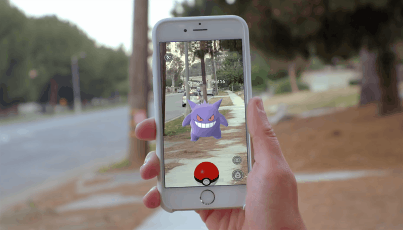

Or are lucky enough to have tried virtual reality system sellers like [Beat Saber](https://github.com/AlinaWithAFace/alinawithaface.github.io/tree/1a9d04fc69b3ad64623cd7951e076f77f9a0135b/_posts/%28beatsaber.com%29).

 

[_Beat Saber via LIV and SwanVR_](https://youtu.be/gV1sw4lfwFw)

The one thing XR technologies have in common is they use computers to shape your perception. XR as a spectrum can put you in wholly new and different environments, or simply add information to the real world.

Machine learning is essentially using particular algorithms to teach computers how to solve problems. It’s used in all sorts of applications, from [mastering Go](https://github.com/AlinaWithAFace/alinawithaface.github.io/tree/1a9d04fc69b3ad64623cd7951e076f77f9a0135b/_posts/%28https:/deepmind.com/research/alphago/%29/README.md)...

 

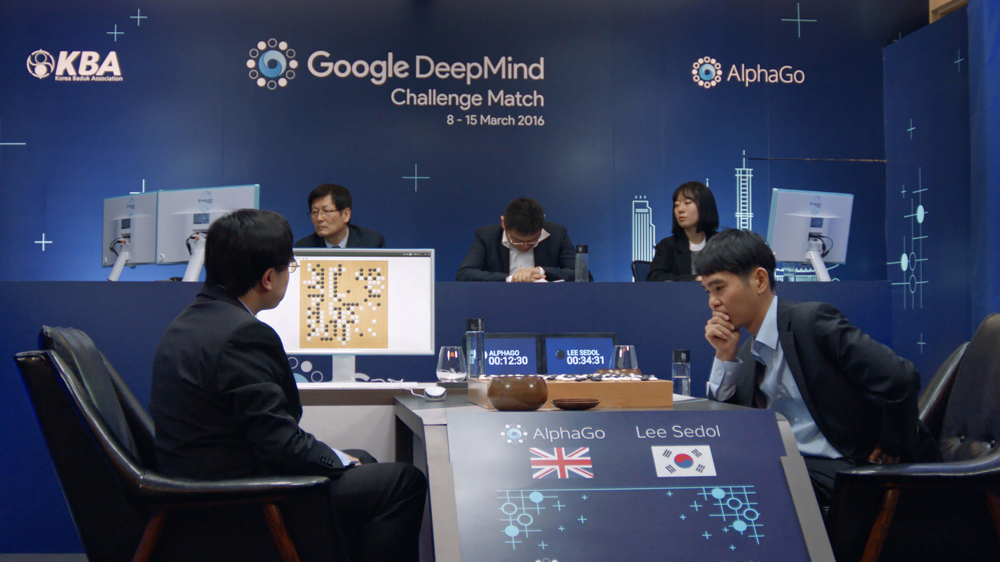

[_Alphago via Alphago Movie_](https://www.alphagomovie.com/images/gallery/gallery-9.jpg)

... to [powering the brains of self-driving cars](https://github.com/AlinaWithAFace/alinawithaface.github.io/tree/1a9d04fc69b3ad64623cd7951e076f77f9a0135b/_posts/%28waymo.com%29),

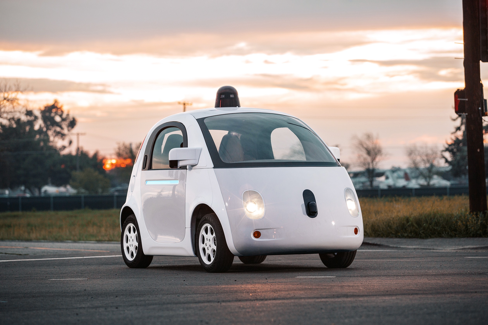

... to [generate cats from a handful of lines](https://github.com/AlinaWithAFace/alinawithaface.github.io/tree/1a9d04fc69b3ad64623cd7951e076f77f9a0135b/_posts/%28https:/affinelayer.com/pixsrv/%29/README.md).

 

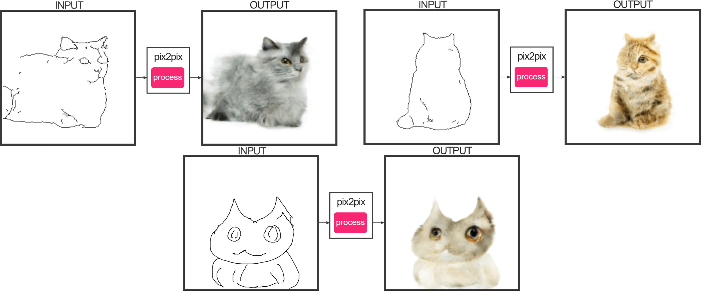

[_Via pix2cats_](https://github.com/AlinaWithAFace/alinawithaface.github.io/tree/1a9d04fc69b3ad64623cd7951e076f77f9a0135b/_posts/%28https:/affinelayer.com/pixsrv/%29/README.md)

I drew that last one, he’s _probably_ okay.

There’s a lot of exciting work using machine learning to see the world through a computer’s eyes.

We're able to take artificial intelligence and show it parts of the world. We can show them our bodies, our paintings, [how objects interact](https://github.com/AlinaWithAFace/alinawithaface.github.io/tree/1a9d04fc69b3ad64623cd7951e076f77f9a0135b/_posts/%28https:/www.youtube.com/watch?v=keffWSqi67w%29/README.md), [see what they come up with](https://github.com/AlinaWithAFace/alinawithaface.github.io/tree/1a9d04fc69b3ad64623cd7951e076f77f9a0135b/_posts/%28youtu.be/FlgLxSLsYWQ%29/README.md), and use that to shape our perception. Machine learning is able to make sense of the vast amount of information in reality, while XR will help us see it more clearly.

 

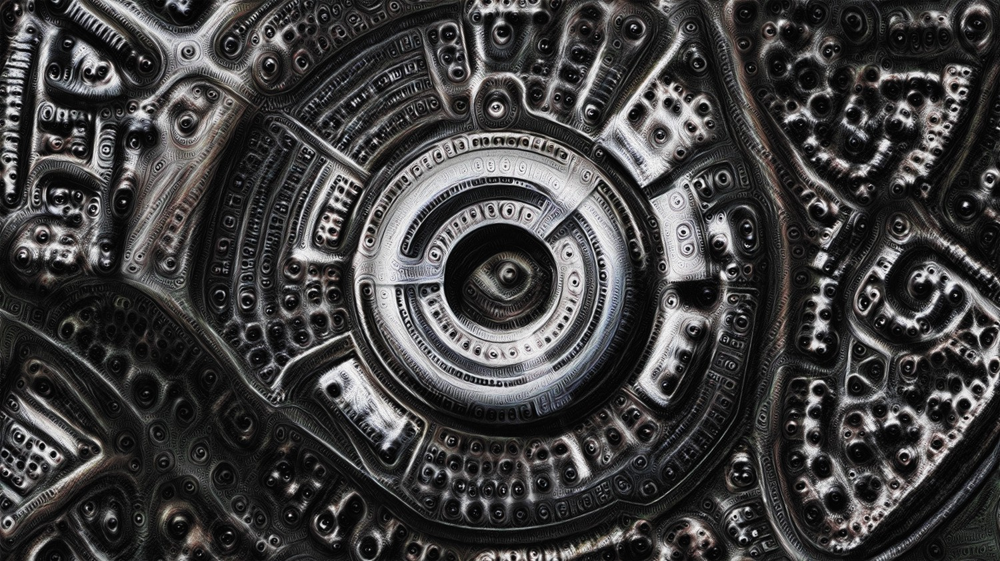

[_All watched over by machines of loving grace: Deep-dream edition \(2015\) via Memo Akten_](https://medium.com/artists-and-machine-intelligence/a-digital-god-for-a-digital-culture-resonate-2016-15ea413432d1)

I feel like some of the most exciting developments have been through open source and publicly funded research projects.

[OpenPose](https://github.com/AlinaWithAFace/alinawithaface.github.io/tree/1a9d04fc69b3ad64623cd7951e076f77f9a0135b/_posts/%28https:/github.com/CMU-Perceptual-Computing-Lab/openpose%29/README.md) is a research project at Carnegie Mellon that uses machine learning to detect bodies in single images.

 [_OpenPose via Carnegie Mellon Perceptual Computing Lab_](https://github.com/AlinaWithAFace/alinawithaface.github.io/tree/1a9d04fc69b3ad64623cd7951e076f77f9a0135b/_posts/%28https:/github.com/CMU-Perceptual-Computing-Lab/openpose%29/README.md)

It’s been used as the backbone for other work, including research projects that help [put your whole body in virtual reality](https://github.com/AlinaWithAFace/alinawithaface.github.io/tree/1a9d04fc69b3ad64623cd7951e076f77f9a0135b/_posts/%28https:/realsense.intel.com/deep-learning-for-vr-ar/%29/README.md)...

 

[_Deep Learning for VR/AR: Body Tracking with Intel RealSense Technology_](https://github.com/AlinaWithAFace/alinawithaface.github.io/tree/1a9d04fc69b3ad64623cd7951e076f77f9a0135b/_posts/%28youtu.be/VSHDyUXSNqY?t=1069%29/README.md)

... and help you, \(or at least, a video of you\) perform [intricate ballet dances](https://github.com/AlinaWithAFace/alinawithaface.github.io/tree/1a9d04fc69b3ad64623cd7951e076f77f9a0135b/_posts/%28https:/carolineec.github.io/everybody_dance_now/%29/README.md).

 

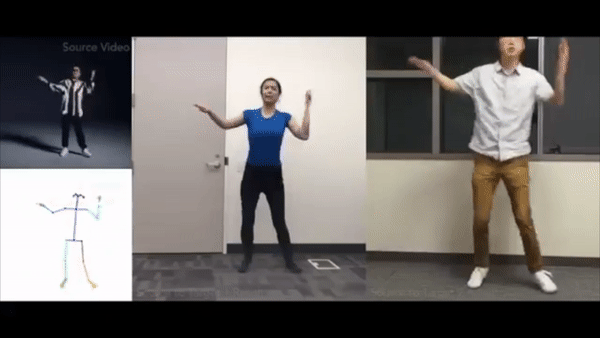

[_Everybody Dance now via Caroline Chan_](https://github.com/AlinaWithAFace/alinawithaface.github.io/tree/1a9d04fc69b3ad64623cd7951e076f77f9a0135b/_posts/%28https:/www.youtube.com/watch?v=PCBTZh41Ris%29/README.md)

[Pix2Pix](https://github.com/AlinaWithAFace/alinawithaface.github.io/tree/1a9d04fc69b3ad64623cd7951e076f77f9a0135b/_posts/%28https:/github.com/phillipi/pix2pix%29/README.md) is a project at Berkeley that uses neural networks to generate images based on training data.

 

[_Pix2Pix via a Affinelayer_](https://affinelayer.com/pix2pix/)

It’s been further remixed into applications that [turn your webcam feed into flowers](https://github.com/AlinaWithAFace/alinawithaface.github.io/tree/1a9d04fc69b3ad64623cd7951e076f77f9a0135b/_posts/%28https:/www.memo.tv/portfolio/learning-to-see/%29/README.md)...

 

[_Learning to See: Gloomy Sunday_](https://github.com/AlinaWithAFace/alinawithaface.github.io/tree/1a9d04fc69b3ad64623cd7951e076f77f9a0135b/_posts/vimeo.com/260612034/README.md)

... or turn photos of Wilmington’s skyline into gorgeous paintings that emulate Van Goh.

 

_via_ [_Deep Dream Generator_](https://github.com/AlinaWithAFace/alinawithaface.github.io/tree/1a9d04fc69b3ad64623cd7951e076f77f9a0135b/_posts/%28https:/deepdreamgenerator.com%29)

[Project North Star](https://github.com/AlinaWithAFace/alinawithaface.github.io/tree/1a9d04fc69b3ad64623cd7951e076f77f9a0135b/_posts/%28https:/developer.leapmotion.com/northstar%29/README.md) is an augmented reality headset that you can literally 3D print anywhere in the world. There’s a [community](https://github.com/AlinaWithAFace/alinawithaface.github.io/tree/1a9d04fc69b3ad64623cd7951e076f77f9a0135b/_posts/%28https:/discord.gg/fSEcBMe%29/README.md) growing around sourcing and building these headsets, and I think we’ll see some interesting applications as it becomes more accessible.

  

These are all open source, so anyone can take their work and build on top of it to make all sorts of applications, which they have.

"They" includes me.

 

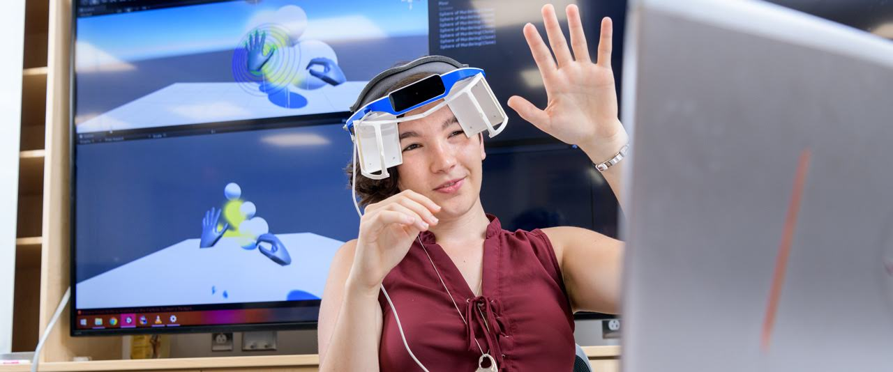

[_Me in my North Star via UDaily_](https://github.com/AlinaWithAFace/alinawithaface.github.io/tree/1a9d04fc69b3ad64623cd7951e076f77f9a0135b/_posts/%28https:/www.udel.edu/udaily/2018/august/alina-christenbury-virtual-reality-summer-research/%29/README.md)

I’m currently building my own North Star. Some of the parts I was able to 3D print back at the University of Delaware, others were sourced from community members that have cropped up around the project. Most of this happened over UD’s summer scholars program, where I took 10 weeks to learn the basics of XR development. After the semester started, I turned that experience into an undergraduate research project focused on getting cross-disciplinary students together to develop XR applications.

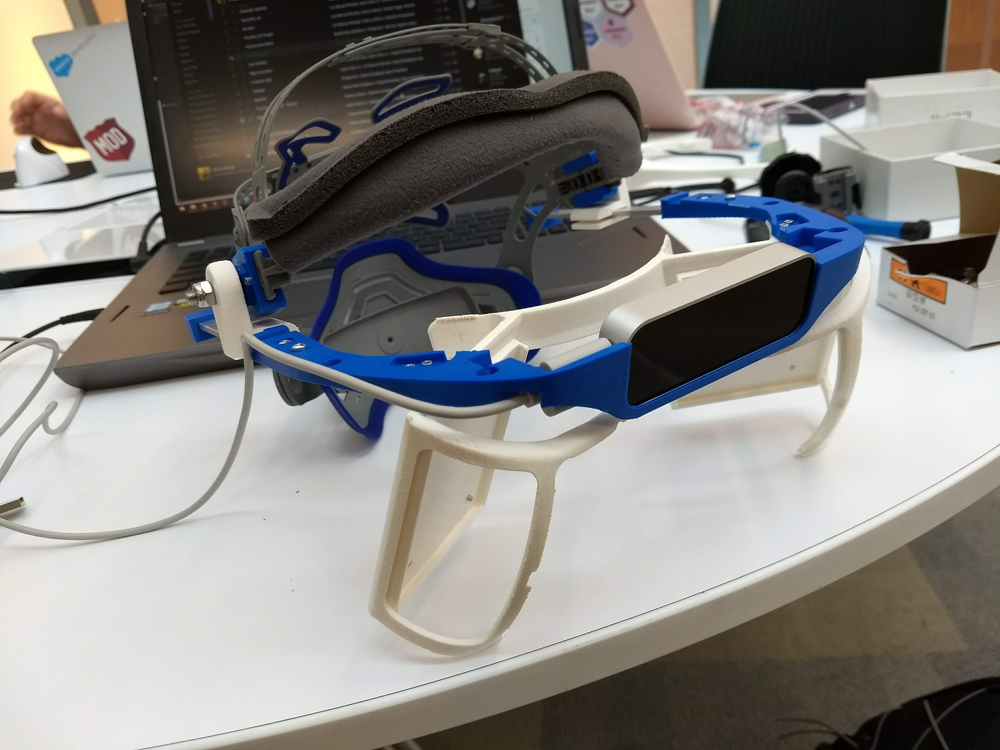

Just last week I went to [Reality Virtually](https://github.com/AlinaWithAFace/alinawithaface.github.io/tree/1a9d04fc69b3ad64623cd7951e076f77f9a0135b/_posts/%28https:/realityvirtuallyhack.com/%29/README.md), a hackathon at MIT’s Media lab. I got together with over 400 other developers, artists, designers, and coders to make XR applications.

 

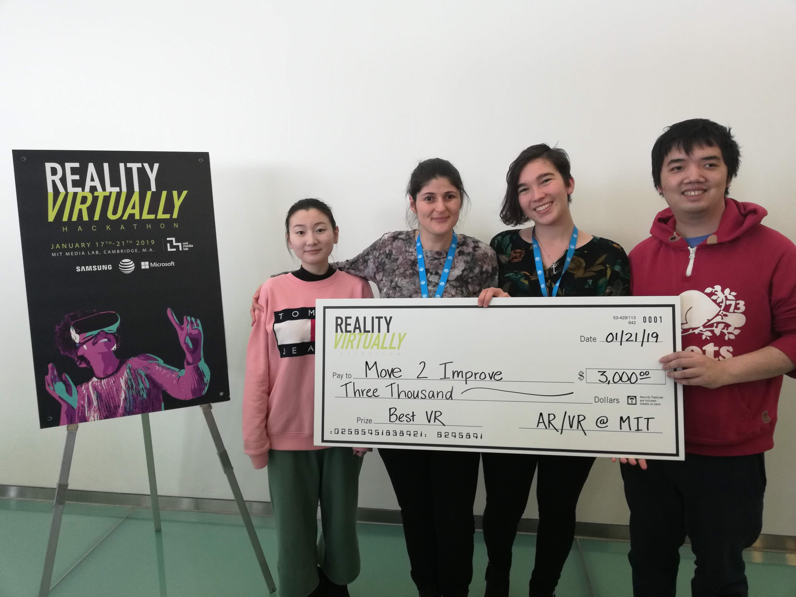

_The University of Delaware Human-Computer Interaction at Reality Virtually. Right to left: Zhang Guo, Dr. Roghayeh Barmaki, Alina Christenbury, Yan-Ming Chiou_

The one rule for all projects at the hackathon was that they had to be open source, so that anyone around the world could take what they made and create new and interesting applications. Together, we made just under 100 XR projects including tools for physical therapy and accessibility, but also games and interactive art. My team made a [VR escape room](https://github.com/AlinaWithAFace/alinawithaface.github.io/tree/1a9d04fc69b3ad64623cd7951e076f77f9a0135b/_posts/%28https:/devpost.com/software/virtual-escape-room-bj9lwv%29/README.md) in under 5 days, and my advisor [Dr. Barmaki’s physical therapy project](https://github.com/AlinaWithAFace/alinawithaface.github.io/tree/1a9d04fc69b3ad64623cd7951e076f77f9a0135b/_posts/%28https:/devpost.com/software/move2improve%29/README.md) won “Best VR application”.

 

[_Escape the Witch's Grotto_](https://www.youtube.com/watch?v=j4SkaYllHz4)

In my mind, this technology really comes together in the concept of [Mirrorworlds](https://github.com/AlinaWithAFace/alinawithaface.github.io/tree/1a9d04fc69b3ad64623cd7951e076f77f9a0135b/_posts/%28http:/blog.leapmotion.com/mirrorworlds/%29/README.md).

 

[_Illustration by Anna Mill_](http://annamill.com/)

Rather than ever leaving your physical space, this technology will help [transform it around you into another parallel dimension](https://github.com/AlinaWithAFace/alinawithaface.github.io/tree/1a9d04fc69b3ad64623cd7951e076f77f9a0135b/_posts/%28https:/cloud.google.com/maps-platform/gaming/%29/README.md). Chairs become mountains, walls become sunsets, and "the floor is lava" transforms from a simple kid's game into a visceral experience. You can interact with digital objects the same way as you would with physical, and interact with physical ones to an even greater effect. Your environment can show you how it works, as items show you how to use them. A guitar could teach you how to play itself, showing you where best to hold it to play particular chords. Or objects could change altogether, as tables turn into touch screens and pencils into wands.

> It's time to shift the conversation from what an AR system should look like, to what an AR experience should feel like. - [David Holz](https://github.com/AlinaWithAFace/alinawithaface.github.io/tree/1a9d04fc69b3ad64623cd7951e076f77f9a0135b/_posts/%28http:/blog.leapmotion.com/northstar/%29/README.md)

The question is no longer "how can we make this work?" but rather "how should this feel?" We’re at point in history where what would have been considered "magic" is real. It’s here, and it’s now. And so, I leave you with this: What will you do with it?

I read many, many, _many_ things to prep for this in order to create something mildly resembling a narrative for this talk. I did my best to save sources, most of which are linked to throughout, but feel free to check the [source](https://github.com/AlinaWithAFace/alinawithaface.github.io/blob/master/_posts/2019-04-29-a-flick-of-the-wrist-defining-the-next-generation-of-human-computer-interaction.md) for a full list.

