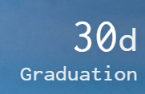

# 👋 Hello World

Hey nerds!  
  
2019 has been a \*year\*.  
  
I did a TedX talk, which is honestly the only real speaking thing I've done in ever  
  
I went to a hackathon at MIT \(and lost! But my adviser won, so net win!\)  
  
I applied and got accepted to grad school with full tuition coverage \(THEY'RE PAYING ME TO LEARN, THE FOOLS! Haha jk it's like 22k a year I'll maybe afford to live\)  
  
I graduate in &lt;30 days, which is super weird, because I'm finishing the tutorial part of life and entering the choose-your-own-adventure section, but then immediately going back to grinding via grad school, the tutorial never ends  
  
I redid my website a bunch to prep it for the nonzero amount of academic writing ahead of me slash because I saw people who have been doing this longer than me and think they're on to something here  
  
I went to GDC and met SO MANY PEOPLE OH MY GOD I LOVE EVERYONE HOW DO YOU MAINTAIN CONFERENCE FRIENDS??? which was super cool, but also San Francisco as a place really shows off an extreme economic inequality that breaks my heart  
  
It was really strange to have one street be this gorgeous glass walled convention center surrounded by big tech companies, then you walked three blocks to the left to find people unconscious in the street  
  
It's one of the things that really makes me feel like UBI is super important, but more on that some other time  
  
I also started this thing you're reading! By that I mean a mailing list!  
  
'But Alina, you have a tweetbook and snapstagram account, why would you ever need something as antiquated as email? '  
  
So, here's the thing: social media has... issues  
  
On one hand, there are people there! Posting super cool things! Being amazing humans! Loving, making, marrying, the works!  
  
Memes!  
  
But on the other you have the fake, the controversial, the clickbait, all driven by mysterious algorithms that have everything in the world fighting to be the content that feeds you  
  
Not to mention the privacy concerns  
  
Point being, I want a channel to connect with people about my life and work and art that's not so aggressively tuned towards whatever flavor of the week our algorithmic overlords happen to be serving today. I want to be messy and unpolished and not just talk about the highlights, but the whole  
  
  
  
  
  
That's this.  
  
  
  
That's you.  
  
  
  
  
  
At least, if that's what you're looking for. I'm not exactly going to chain you to the furniture, but I think it's important to mention my motivation here  
  
SO, yeah! We cool? Cool.  
  
I've been spending a lot of time talking to people \(mostly professors, some students\) about what it means to 'get a PhD', and there have definitely been some overlapping themes  
  
'Coursework is filler, focus on research' has been a strong one  
  
But then that begs another question, what is research? Like are we talking high level academic shitposting ala [Sigbovik](http://www.sigbovik.org/)? Or Literally Curing Cancer™️? Somewhere in between?  
  
Either way, I think I have an idea for a dissertation already? But I'm not really sure what other work has been done about it so far? Or if I should talk about it at all in fear of people stealing my thunder? Also what even is a dissertation???  
  
Academia's weird. I'll let you know when I figure it out. Maybe they have a handbook or something  
  
I \*officially\* start in June. I unofficially started last fall, but that's besides the point  
  
So, here we are now. I plan to email you guys when I have something interesting but incomplete to show off, or A Thing Happened that I think is important or if I feel inclined to write a bunch about something, etc, but that's enough for the moment  
  
See you when I see you ♥️  
-Alina

