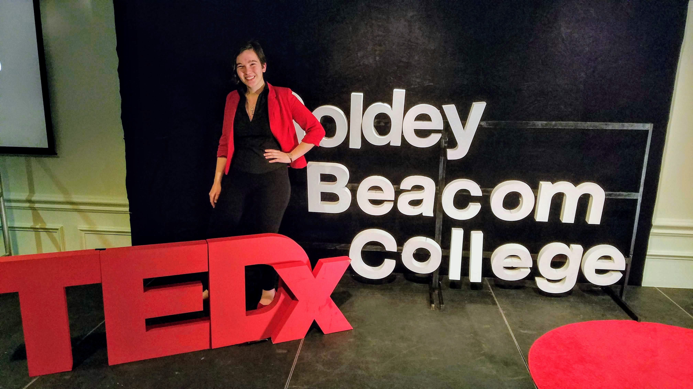

# Hiya!

I'm _**Alina Christenbury**_, an upcoming PhD student at the [Sensify Lab](https://www.sensifylab.cis.udel.edu) at the [University of Delaware](https://www.udel.edu/) where my advisor is Matthew Louis Mauriello. I also founded the [Delaware Games Collective](http://delawaregamescollective.org), an organization dedicated to connecting game developers, artists, and workers in the state of Delaware. My full CV can be found [here](http://alinac.me/cv/).

I'm particularly interested in game design, spatial computing, and machine learning applications. Feel free to keep in touch by joining my [mailing list](http://alinac.me/subscribe) or following me on [Twitter](https://twitter.com/AlinaWithAFace).

